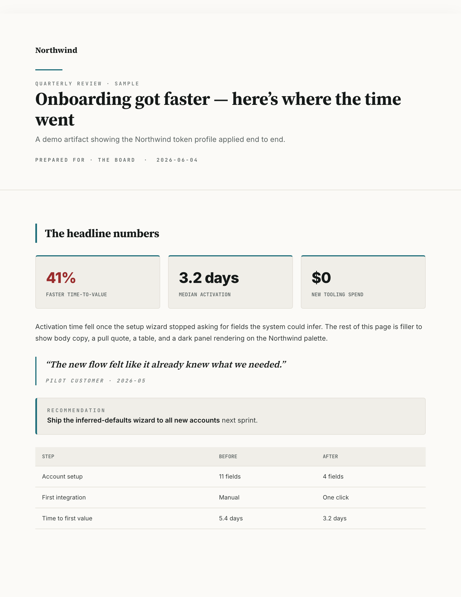
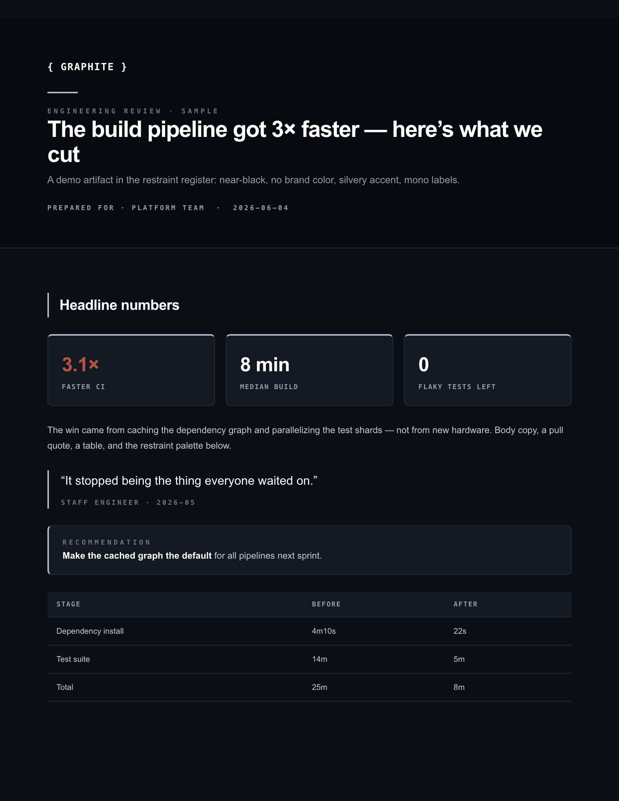
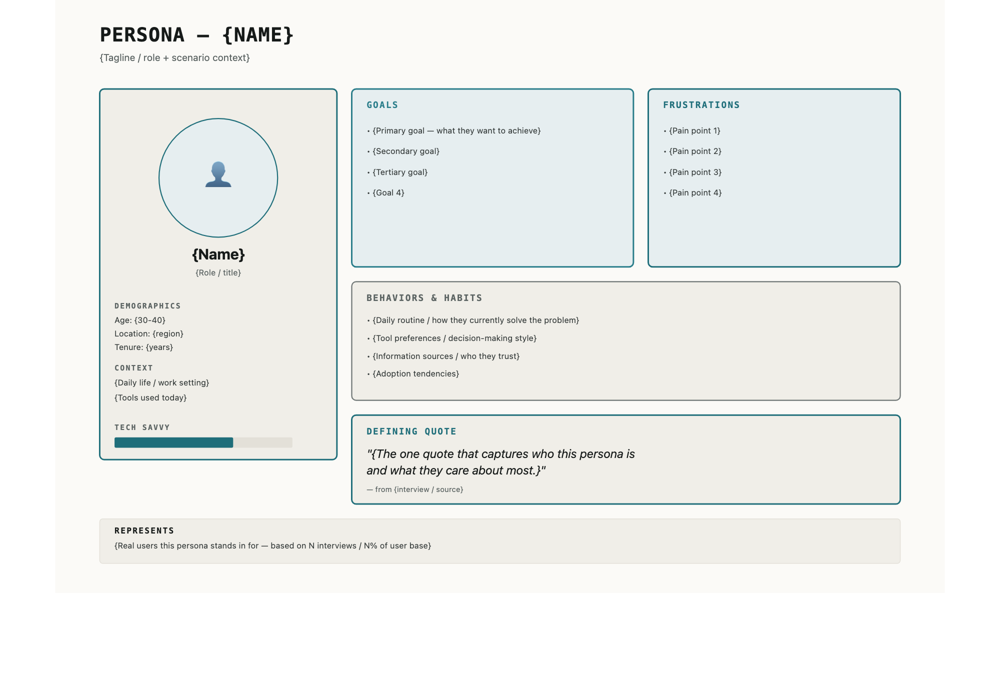
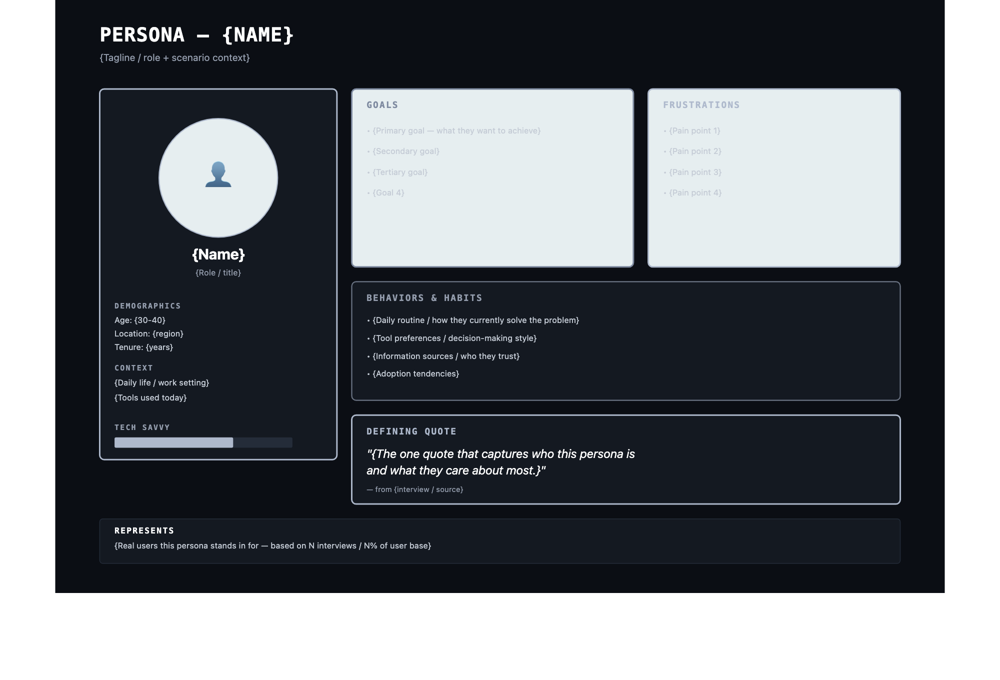

# brand-system-kit

[](https://github.com/derekcedarbaum2/brand-system-kit/actions/workflows/ci.yml)
&nbsp;
&nbsp;

**A brand system you can run, not just read.**

Most brand guidelines are a PDF nobody opens and nothing enforces. So colors drift. The wrong blue ships. A deck looks off and no one can say why. This kit makes the rules executable: you define a brand once, in one file, and the tooling keeps every output on-brand — or fails the build.

What's inside:

- **One source of truth.** Every color and font lives in a single `tokens.json`. The CSS and the docs are generated from it, so they can't drift apart.
- **A linter that blocks off-brand output.** Banned words, off-palette colors, gradients, and one brand's name leaking into another's artifact all fail the check.
- **An accessibility gate.** Every palette is checked against WCAG AA contrast — computed, not eyeballed.
- **A render step.** It turns any artifact into an image so you (or an AI agent) can judge what a rule can't: does this actually *look* right?

Zero dependencies — plain Node ≥18. Any agent (Codex, Cursor, Claude Code) can scaffold a new brand by running the built-in interview in [`docs/brand-interview.md`](docs/brand-interview.md); Claude Code also gets it as a `/brand-init` skill.

It ships with two working brands — **Northwind** and **Graphite** — so the whole pipeline runs the moment you clone it. They're opposites on purpose (the [one idea](#the-one-idea) below), which is the fastest way to see what the kit does. Replace them with yours.

## Preview

Same kit, two registers. Left: Northwind (warmth — light, serif, editorial accent). Right: Graphite (restraint — near-black, no brand color, mono labels).

| Northwind (warmth) | Graphite (restraint) |
|---|---|
|  |  |

One diagram, re-skinned to each brand by swapping the token profile — nothing hand-edited:

| `--palette northwind` | `--palette graphite` |
|---|---|
|  |  |

> This is the *bones*, not a brand. There's no "right" palette here — the kit is the machine that makes any brand consistent and enforceable.

> **Using an AI agent to set this up?** Point it at [`AGENTS.md`](AGENTS.md) — step-by-step install, verification, and "scaffold a brand" instructions written to be followed literally.

---

## The one idea

*The single principle the whole kit is built on — why two brands, and why they look nothing alike.*

> **Match the visual register to the buyer's trust model.**

One philosophy, two registers, because two buyers grant trust for opposite reasons:

| Register | Buyer | Distrusts | Trust comes from |
|---|---|---|---|
| **Restraint** | Technical operator | Polish, hype, salesmanship | Near-black, no brand color, mono labels — "we're not selling you" |
| **Warmth** | Non-technical exec | Hackers, vendors, "AI" hand-waving | Light, serif headlines, one editorial accent — "advisor, not vendor" |

Restraint and warmth aren't opposite philosophies — they're the same discipline (argument first, evidence over decoration, hierarchy through restraint) aimed at different fears. If you sell to more than one kind of buyer, you need more than one register — which is why the kit is multi-profile.

---

## Architecture: generic core + profiles

*Where everything lives. Four parts: the prose framework (`system/`), the executable tooling (`tooling/`), the brands (`profiles/`), and the diagram templates (`diagrams/`).*

```
brand-system-kit/
  system/                  # the bones — the brand-system guides (generic)
    identity.md            #   philosophy + the meta-thesis (register ↔ trust model)
    typography.md  components.md  spacing.md  motion.md
    color-system.md  tokens-screen.md  tokens-print.md  tokens-email.md
    voice-and-tone.md  anti-patterns.md  lint-rules.md  imagery.md
    data-viz.md  slide-layouts.md  accessibility.md  medium-guide.md  README.md
    print-layout.md        #   HTML→PDF mechanics: full-bleed bg, sheet pagination, no-split cards
  tooling/                 # the executable system (zero-dep Node ≥18)
    build-tokens.mjs       #   tokens.json → CSS :root block + Markdown palette table
    contrast-check.mjs     #   WCAG 2.1 AA, computed from tokens.json (mode-aware)
    lint.mjs               #   gate an artifact: banned words, off-token hex, gradients, name leakage
    render.mjs             #   HTML → PNG (headless Chrome) for visual critique
    brand-qa.mjs           #   one command: contrast + lint + optional render
    tokenize-svg.mjs       #   hardcoded-hex SVG → var()-driven, re-skinnable per profile
  profiles/
    northwind/             # DEMO brand (invented). Your brands become siblings here.
      tokens.json          #   the single source of truth
      brand.css  color-system.md  sample.html   # all generated/derived
  diagrams/                # 37 token-driven SVG templates (re-skin to any profile)
  docs/brand-interview.md  # tool-agnostic interview an agent runs to scaffold a brand
  skill/brand-init/        # Claude Code wrapper around docs/brand-interview.md
  examples/bad.html        # an artifact full of violations, to see the linter bite
```

`system/` is the prose framework (read these to understand the *why*); `tooling/` enforces it; `profiles/` are the brands; `diagrams/` are ready-to-skin templates.

Each brand is a **profile** = one `tokens.json`. The tooling is brand-agnostic; it never hard-codes a palette.

---

## Quickstart

*See the whole pipeline work in 30 seconds. Clone the repo and run these four commands from its root against the bundled demo brand — no install. You should get three passes and one deliberate failure (the linter catching a bad file).*

```bash
# 1. Check the demo palette is accessible (it is)
node tooling/contrast-check.mjs profiles/northwind

# 2. Generate CSS + palette table from the tokens
node tooling/build-tokens.mjs profiles/northwind/tokens.json profiles/northwind/brand.css --md profiles/northwind/color-system.md

# 3. Gate an artifact (contrast + lint), and render it for the eye test
node tooling/brand-qa.mjs profiles/northwind/sample.html profiles/northwind --render

# 4. See the linter bite
node tooling/lint.mjs examples/bad.html profiles/northwind   # exits 1
```

`render.mjs` needs Chrome/Chromium; set `CHROME_PATH` if it isn't auto-found.

---

## Make your own

*How to turn this into **your** brand — let an agent interview you, or copy the demo and edit by hand.*

- **With any agent (Codex, Cursor, Claude Code):** have it follow [`docs/brand-interview.md`](docs/brand-interview.md). It asks about your audience, derives the register, then writes a WCAG-passing `tokens.json`, generates the CSS, and renders a sample. In Claude Code, just run `/brand-init`.
- **By hand:** copy `profiles/northwind/` to `profiles/<your-brand>/`, edit `tokens.json`, and re-run the Quickstart commands against your new profile.

Then wire `brand-qa.mjs` into whatever produces your artifacts (a docs build, a deck generator, a CI step) so nothing ships ungated.

---

## Design tokens

Tokens are [DTCG format](https://www.designtokens.org/) (W3C Design Tokens, first stable spec). `tokens.json` is the only place hex lives — CSS and docs are generated from it, so they can't drift. The `lint` group carries non-visual constants (brand name, forbidden hexes, accent budget, foreign-name list) that the gate reads.

## What it deliberately doesn't do

No design opinions beyond "be consistent and accessible." No fonts bundled (loaded from Google Fonts in the demo CSS — swap freely). No framework. It's plumbing.

## License

MIT — see [LICENSE](LICENSE).
